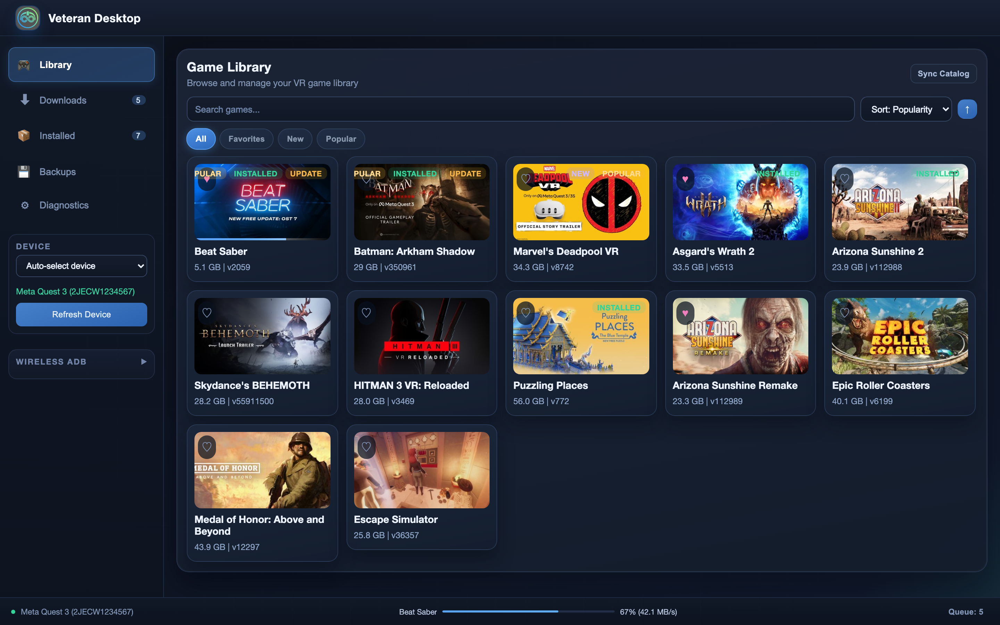
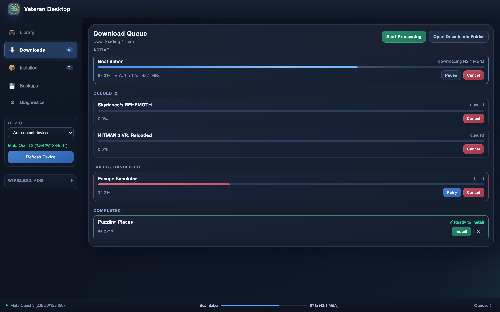
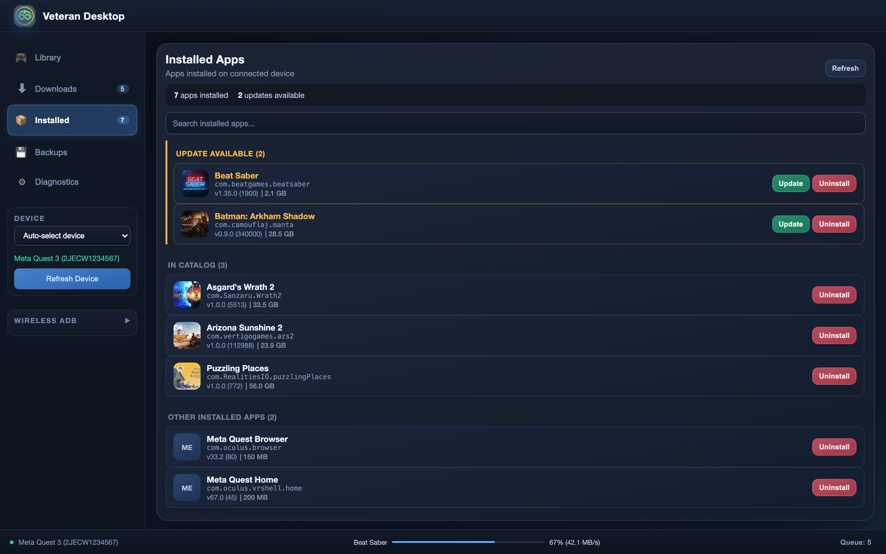
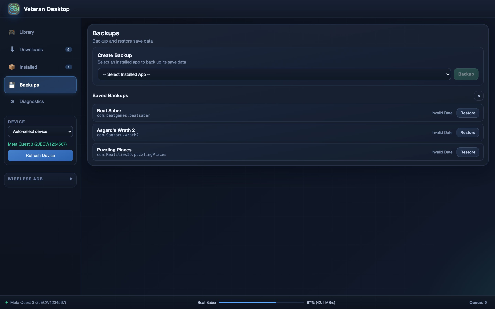
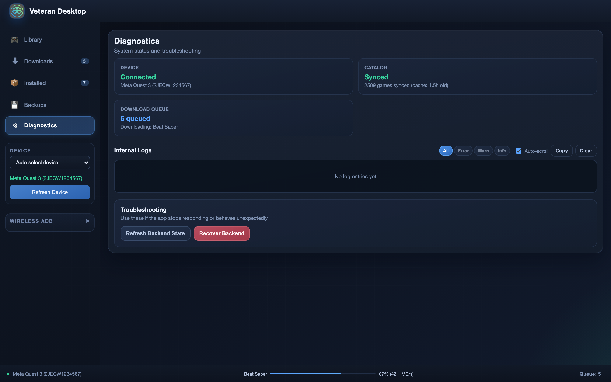

# Veteran Desktop

A cross-platform VR sideloading application for managing, downloading, and installing content onto Android-based VR headsets like the Meta Quest. Built with **Rust** + **Tauri v2** on the backend and **React 19** + **TypeScript** on the frontend.


> **⚠️ IMPORTANT: You MUST enable Developer Mode on your Quest headset before using this app!**
>
> **[👉 Click here for instructions on enabling Developer Mode](https://vrpirates.wiki/en/Howto/enabling-dev-mode)**



## Features

### Game Library
Browse a full catalog of VR titles with search, sorting (by name, popularity, date, or size), and filtering. Each game card shows metadata at a glance, including size, version, and download popularity. Favorites, "New", and "Popular" badges help you find what you're looking for quickly.


Click any title to open a detailed view with an embedded **YouTube trailer**, package metadata, release notes, and one-click download/install actions.

### Download Manager
Queue multiple games for download with full progress tracking, speed indicators, and ETA estimates. Pause, resume, cancel, or retry individual downloads. Completed downloads can be installed directly from the queue.



### Installed Apps
View all applications installed on your connected device, organized into sections: updates available, games in catalog, and other installed apps. Update or uninstall apps with a single click.



### Backups
Back up and restore save data for any installed app. Select an app, create a timestamped backup, and restore it later if needed.



### Diagnostics
Monitor device connection status, catalog sync state, and download queue health at a glance. An internal log viewer with level filtering (Error, Warn, Info) helps with troubleshooting, along with backend recovery tools.



### Device Management
- Automatic device detection via ADB
- Wireless ADB connection with auto-reconnect
- Battery level, storage details, and connection state displayed in the sidebar
- Device selection when multiple headsets are connected

## Tech Stack

| Layer | Technology |
|-------|-----------|
| Backend | Rust, Tauri v2 |
| Frontend | React 19, TypeScript, Vite |
| IPC | tauri-specta (auto-generated type-safe bindings) |
| Downloads | Rclone RCD API |
| Device Comms | ADB (USB + Wireless) |
| Extraction | 7-Zip |

## Quick Start

```bash
cd veteran-desktop

# Install frontend dependencies
cd frontend && npm install && cd ..

# Development (starts backend + frontend with HMR)
cargo tauri dev

# Production build
./scripts/download-binaries.sh
cargo tauri build
```

## Cross-Platform Builds

```bash
./scripts/build-all.sh             # All platforms
./scripts/build-all.sh mac-arm     # macOS Apple Silicon
./scripts/build-all.sh mac-x86     # macOS Intel
./scripts/build-all.sh linux       # Linux x86_64
./scripts/build-all.sh windows     # Windows x86_64
```

### Prerequisites

- **Rust** (latest stable)
- **Node.js** (LTS)
- **ADB** and **Rclone** on your `PATH`
- Cross-compilation from macOS:
  - Linux: `brew install messense/macos-cross-toolchains/x86_64-unknown-linux-gnu`
  - Windows: `cargo install cargo-xwin`

## Development

See [`veteran-desktop/README.md`](veteran-desktop/README.md) for the full development guide, including TypeScript binding regeneration, project structure, and contributing guidelines.
